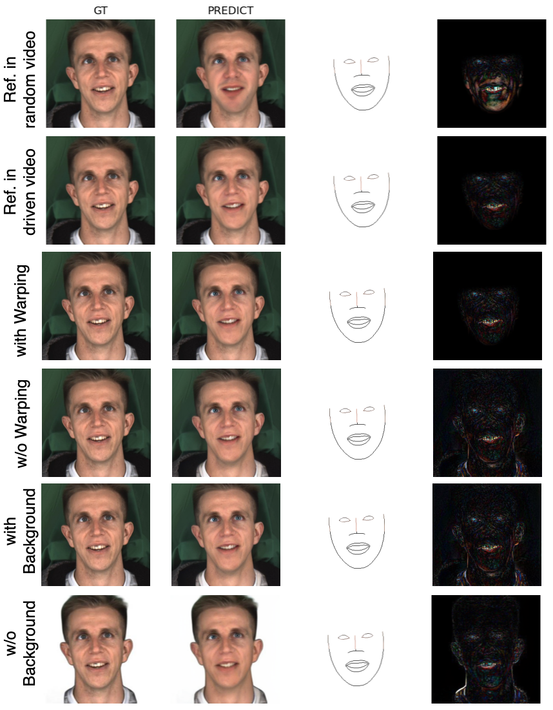

# PMFS: Progressive Mouth-to-Face Synthesis for Realistic Talking Face Generation

## Click on the image to watch the demo

### Description:
- **Audio sample:** `M003_Angry_Level01_005`
- **First column:** Displays the mouth landmark of `M003_Angry_Level01_005`
- **Top three rows:** Use images from the MEAD dataset, including `M003`, `M030`, and `W024`
- **Bottom two rows:** Use images from the CREMA-D dataset, including `1001` and `1002`

### Notes:
- The **PMFS** model was trained only on the MEAD dataset but did not include `M003`, `M030`, or `W024` during training.
- The **CREMA-D** dataset was not used for training at all.
- The video quality on YouTube may be reduced. You can watch the demo video directly at `assets/compare.mp4`.

## More sample
### Using a video of an Asian individual to assess the model's ability to generalize across different identities
### Notes:
- The video quality on YouTube may be reduced. You can watch the demo video directly at `assets/VTV_M003Angry01005.mp4`.
  

## Ablation study
Comparison of image synthesis quality under different conditions. The first two rows compare reference images from the driven video and a random video. The next two rows show results with and without warping. The last two rows illustrate the impact of background presence. The final image in each row is an enhanced heatmap visualization, highlighting synthesis errors.

